# Cart Rebound — the plain-English guide

You do not need to be technical to use Cart Rebound. If you can run a WooCommerce store, you can run this.

This guide starts from zero: what the plugin is for, how to switch it on, and then a tour of every screen with a picture of it. Every screenshot here came from a real store.

> Looking for hooks, the REST API, or how the internals work? That is [USAGE.md](USAGE.md). This guide is for the person running the shop.

---

## Contents

**Getting started**

1. [The problem this solves](#the-problem-this-solves)
2. [Set it up in five minutes](#set-it-up-in-five-minutes)
3. [What happens after that](#what-happens-after-that)
4. [Words you will see](#words-you-will-see)
5. [Your first week](#your-first-week)

**The screens, one by one**

6. [Dashboard — how am I doing?](#dashboard--how-am-i-doing)
7. [Carts — who left what behind](#carts--who-left-what-behind)
8. [Templates — writing the email](#templates--writing-the-email)
9. [Log — what the plugin did and when](#log--what-the-plugin-did-and-when)
10. [Settings — the knobs](#settings--the-knobs)

**Good to know**

11. [What your customer sees](#what-your-customer-sees)
12. [The whole journey on one page](#the-whole-journey-on-one-page)
13. [Accessibility and other languages](#accessibility-and-other-languages)
14. [If something looks wrong](#if-something-looks-wrong)

---

## The problem this solves

Someone visits your shop. They add a jacket to their cart. They get as far as the checkout form, type their email… and then the phone rings, or the bus arrives, or they decide to think about it. They never come back.

That is an **abandoned cart**. It happens on every store, to most visitors. The jacket is still sitting in their cart — they just never finished.

Cart Rebound does three things about it:

1. **Remembers the cart.** What was in it, what it was worth, and — if they got as far as typing it — who they are.
2. **Sends one reminder.** A single email with a button that rebuilds their exact cart and drops them back at checkout. One click, nothing to re-add.
3. **Tells you if it worked.** When that person comes back and pays, the order is tied to the cart it came from, and the money shows up as **recovered revenue** on your dashboard.

A few things worth knowing up front:

- **It all runs on your own site.** No account to create, no monthly fee, no third-party service, and no customer data leaves your server.
- **It does not guess.** An order only counts as recovered when Cart Rebound can prove which cart it came from. It never matches two orders together just because the totals look similar.
- **It sends one email per abandoned cart**, not a drip campaign. Quiet by design.

**Before you start, you need:** WordPress 6.2 or newer, PHP 7.4 or newer, and WooCommerce installed and active. WordPress will refuse to activate Cart Rebound without WooCommerce, so if the Activate link is greyed out, that is why.

---

## Set it up in five minutes

### Step 1 — Install and activate

Install Cart Rebound the way you install any plugin (**Plugins → Add New → Upload Plugin**, then **Activate**), and make sure WooCommerce is already active.

You will get a new **Cart Rebound** item in the left-hand admin menu, with five pages under it: Dashboard, Carts, Templates, Log, Settings.

### Step 2 — Answer four questions

The first time you open **Cart Rebound**, a short wizard appears. It only asks what actually matters.

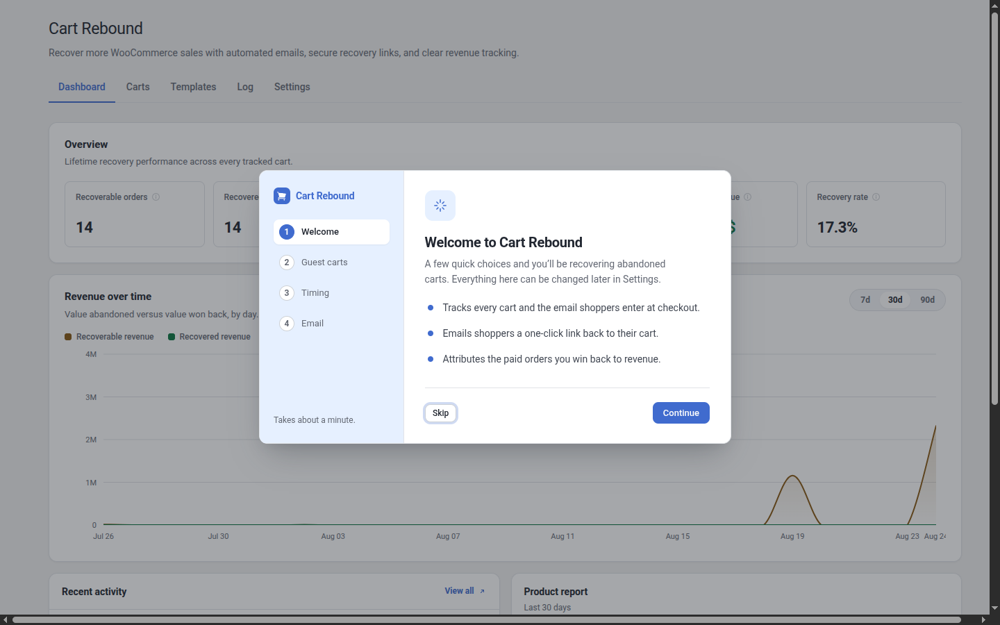

| Step               | It asks                                                     | If you are not sure, pick this                                                                                       |
| ------------------ | ----------------------------------------------------------- | -------------------------------------------------------------------------------------------------------------------- |
| **1. Welcome**     | Nothing — it just explains what is coming.                  | **Continue**                                                                                                         |
| **2. Guest carts** | Should we track people who are not logged in?               | **Yes.** Most people who abandon a cart never had an account. Leaving this off means missing most of them.           |
| **3. Timing**      | How long can a cart sit untouched before it counts as lost? | **30 to 60 minutes.** Much shorter and you will email people who are still browsing in another tab.                  |
| **4. Email**       | Send a reminder, and how long afterwards?                   | **Yes, 60 minutes.** Long enough that they have really gone, soon enough that they still remember wanting the thing. |

Press **Finish setup** and you are done. Nothing here is permanent — every answer lives on the **Settings** page and can be changed whenever you like. **Skip** dismisses the wizard for good and leaves the defaults in place.

### Step 3 — Check your email actually sends

This is the one step people skip and then wonder why nothing works.

WordPress is bad at sending email on its own. Most hosts either block it or let it land in spam. Before you rely on recovery emails, go to **Cart Rebound → Templates**, type your own address into the box at the bottom, and press **Send test**.

- **The test arrives** → you are good.
- **Nothing arrives** → install an SMTP plugin (WP Mail SMTP, Fluent SMTP, and others are free) and connect it to your email provider. Then test again.

That is the whole setup. Cart Rebound is already watching carts.

---

## What happens after that

Nothing, visibly — and that is correct. Here is the story it is quietly running, using real numbers so you can follow along.

**10:04 am.** Maria adds a £45 jacket to her cart. Cart Rebound records the cart. She is just **Active** — a normal shopper, still shopping.

**10:07 am.** She reaches checkout and types `maria@example.com` into the email box. Cart Rebound saves that immediately — she does **not** have to press anything or finish the order. Now the cart has a name attached to it.

**10:09 am.** She closes the tab.

**11:09 am** (an hour later, because that is the threshold you chose). Cart Rebound notices nothing has happened and marks the cart **Abandoned**. The clock for the reminder email starts.

**12:09 pm** (an hour after that, your send delay). Maria gets one email: _"You left something in your cart"_, with her jacket listed and a **Complete your order** button.

**12:20 pm.** She taps the button on her phone. Her cart rebuilds itself — same jacket, same quantity — and checkout opens with her email and name already filled in. She pays.

**12:21 pm.** The order is tied back to her cart. The cart's status becomes **Recovered**, and £45 lands in **Recovered revenue** on your dashboard.

That is the whole product. Everything else in this guide is you looking in on that process, or adjusting it.

---

## Words you will see

Six words do most of the work. Learn these and the rest of the plugin reads easily.

| Word                | What it means, plainly                                                                                                                                     |
| ------------------- | ---------------------------------------------------------------------------------------------------------------------------------------------------------- |
| **Active**          | Someone is shopping right now. Nothing to do.                                                                                                              |
| **Abandoned**       | They stopped, and enough time has passed that we think they are gone. This is the one you can still win back.                                              |
| **Pending payment** | They _did_ order — but haven't paid yet (a cheque, a bank transfer, a slow payment method). Do **not** email these people; they think they have bought it. |
| **Recovered**       | They abandoned a cart, came back, and paid. **This is the win.**                                                                                           |
| **Completed**       | They bought without ever abandoning. A normal sale — Cart Rebound gets no credit, and claims none.                                                         |
| **Lost**            | An abandoned cart that was tidied away without ever converting, or a sale that was later refunded or cancelled.                                            |

Two more you will bump into:

- **Threshold** — how long a cart sits untouched before it counts as abandoned.
- **Merge tag** — a placeholder in your email like `{first_name}` that gets swapped for the real thing when the email goes out. Write `Hi {first_name},` and Maria reads `Hi Maria,`.

---

## Your first week

So you know what normal looks like:

- **Day 1:** the Carts list fills up with **Active** rows. Nothing is abandoned yet — that takes an hour of inactivity.
- **Day 1, an hour in:** the first **Abandoned** rows appear, but only for people who got as far as typing an email. That is expected and it is not a bug: without an email address there is nobody to write to.
- **Day 1–2:** the first recovery emails go out. Check the **Log** to see them leave.
- **Day 2–7:** your first **Recovered** row. Recovery rates of a few percent are normal, and vary hugely by store and price point. Do not judge it on three carts.
- **Ongoing:** old unconverted carts are tidied away automatically after 30 days, so the list never grows forever.

**Most common surprise:** far fewer abandoned carts than visitors. That is because a cart only becomes abandoned once someone has given you an email address. Everyone who bounced before the checkout form stays **Active** and is quietly cleaned up later.

---

## Dashboard — how am I doing?

**Cart Rebound → Dashboard** answers one question: is this making me money?

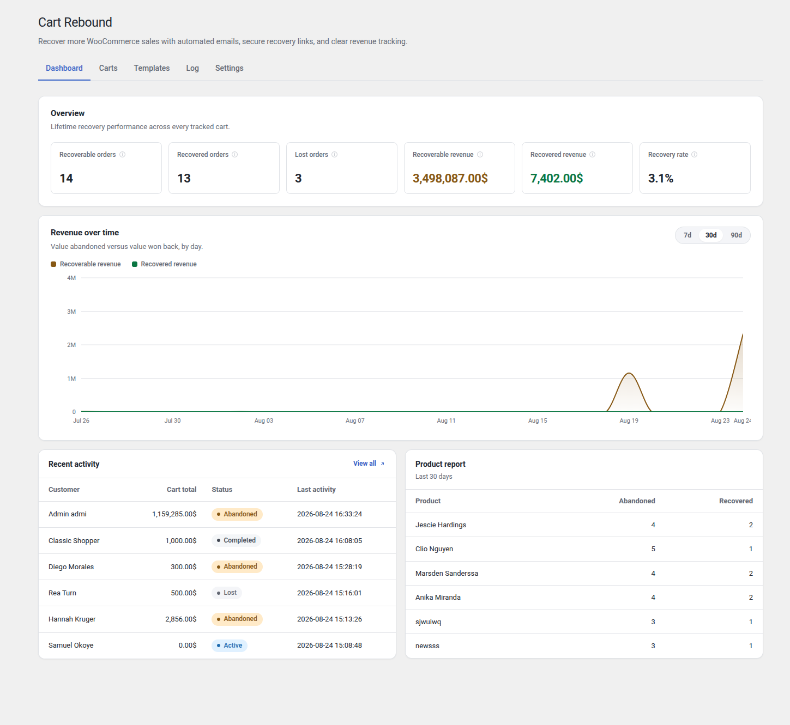

The six boxes across the top:

| Box                     | In one line                                                    |
| ----------------------- | -------------------------------------------------------------- |
| **Recoverable orders**  | Carts sitting in Abandoned right now — your live opportunity.  |
| **Recovered orders**    | How many you have won back.                                    |
| **Lost orders**         | Ones that got away, plus sales later refunded or cancelled.    |
| **Recoverable revenue** | What those abandoned carts are worth if every one came back.   |
| **Recovered revenue**   | Money you have actually won back. **The number that matters.** |
| **Recovery rate**       | The share of all abandoned carts you have ever won back.       |

Every box has a small **ⓘ** — hover it and the definition appears, so you never have to come back here.

> **One thing that confuses people:** the recovery rate will not match _recovered ÷ recoverable_ from the boxes beside it. That is on purpose. Those two boxes are a snapshot of right now, but old unconverted carts get cleaned up after 30 days — so if the rate were worked out from them, it would creep upward every time the store tidied itself and flatter you with a number that was not true. The rate is counted separately, across your whole history, and cleanup cannot touch it.

Below the boxes:

- **Revenue over time** — value abandoned against value won back, day by day. Switch between the last 7, 30 or 90 days.
- **Recent activity** — the six most recent carts, whatever their status.
- **Product report** — which products get abandoned most, and how many of each came back. Useful for spotting a product where something at checkout is putting people off.

---

## Carts — who left what behind

### The list

**Cart Rebound → Carts** is every cart the plugin has ever tracked.

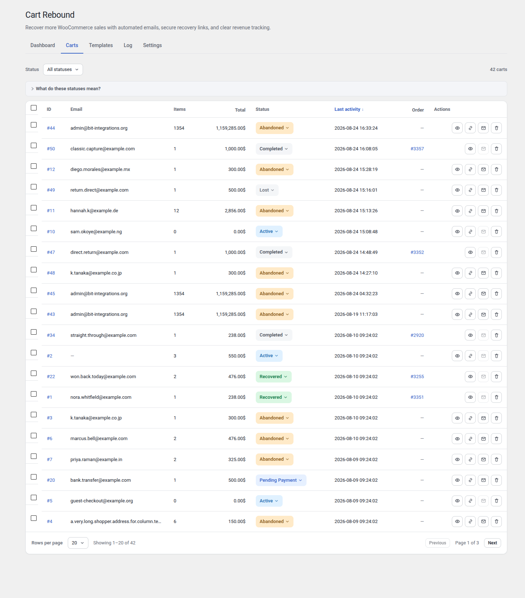

- **Status** (top left) narrows the list to one kind — pick **Abandoned** to see just the ones worth chasing.
- **Any column heading sorts.** Click once for smallest-first, again for largest-first. Sorting by **Total** finds your most valuable abandoned carts.
- **Rows per page** at the bottom offers 10 up to 100.
- The **Order** column links straight to the WooCommerce order, for carts that converted.

Each row has up to four little buttons on the right:

| Button | What it does                      | Greyed out when                                                         |
| ------ | --------------------------------- | ----------------------------------------------------------------------- |
| 👁      | Open the full cart                | never                                                                   |
| 🔗     | Tie this cart to an order by hand | the cart already has an order                                           |
| ✉      | Send the reminder email now       | no email address, the cart is empty, or it already turned into an order |
| 🗑      | Delete the cart                   | never                                                                   |

If a button is greyed out, hover it — it tells you exactly why rather than leaving you guessing.

### What the statuses mean

Click **What do these statuses mean?** above the table and the plugin explains itself, no manual required.

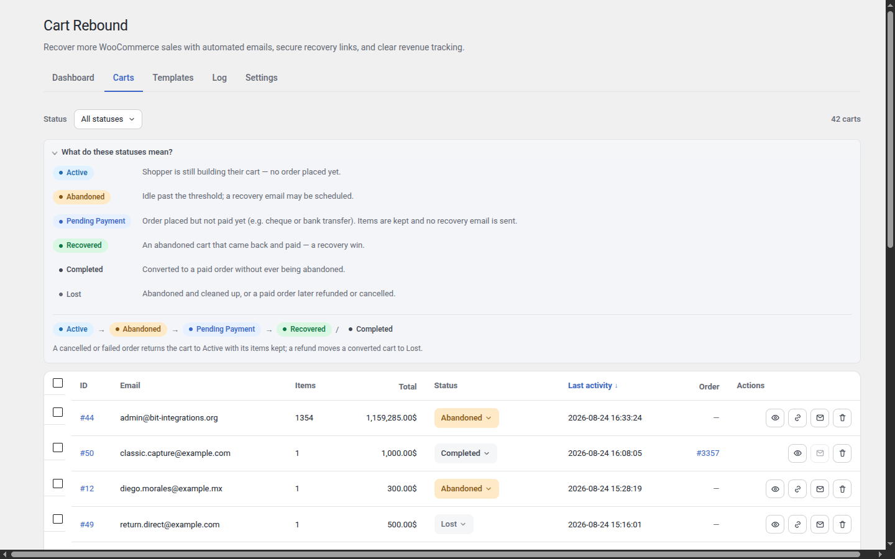

The two rules worth remembering:

- **A cancelled or failed order puts the cart back to Active**, items intact, so it can be recovered like any other.
- **A refund moves a converted cart to Lost** and takes the money back out of your recovered revenue. Your reporting will never count a sale that got reversed.

You can also change a status by hand using the coloured dropdown in each row — handy for correcting something, though you will rarely need to.

### Looking inside a cart

Click the eye (or the cart's ID) to see everything: who they are, what was in the basket, and when each thing happened.

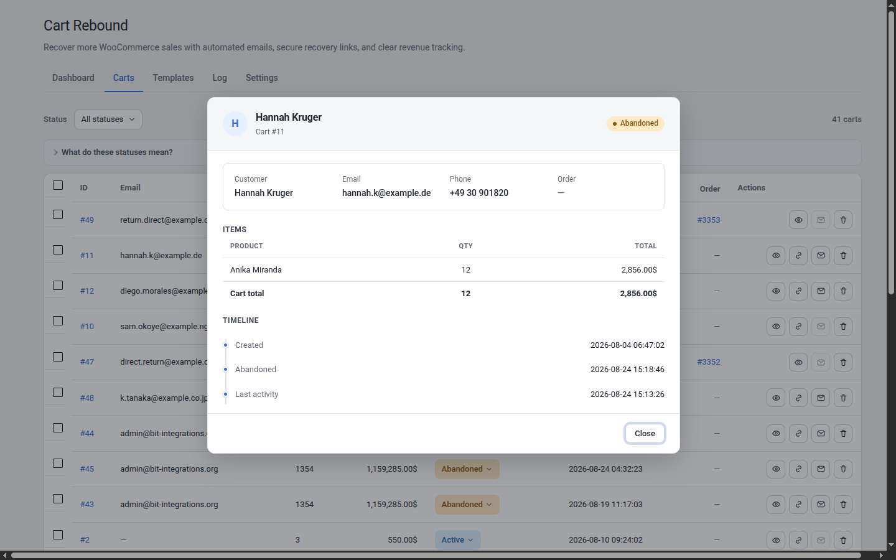

The **Timeline** at the bottom is the useful part — it shows exactly when the cart was created, when it was marked abandoned, and when it was recovered.

### Sending the reminder yourself

The ✉ button sends the recovery email straight away, using whichever template you pick.

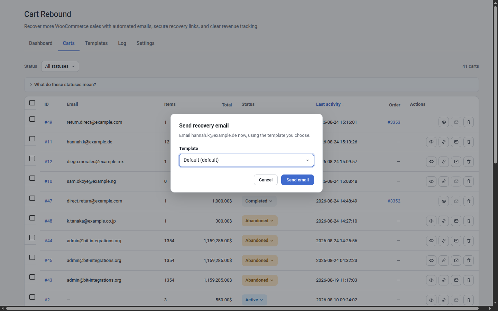

Use it when you want to nudge one particular customer without waiting.

Cart Rebound will politely refuse to send if the cart has no valid email address, if it is empty, if it already became an order, or if that person has unsubscribed. **If it refuses, it tells you why right there in the box** — so if you press Send and see a red message, read it; it is the actual reason.

### Tying a cart to an order by hand

Sometimes an order and its cart never get connected automatically — an order you created manually, an unusual payment gateway, a store that was mid-migration. The 🔗 button connects them.

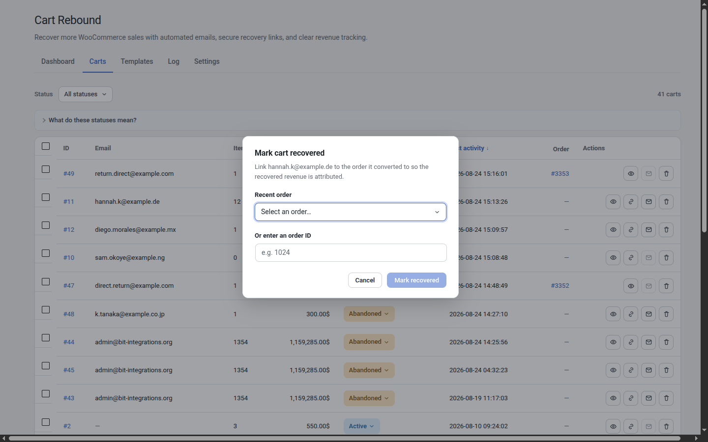

Choose from recent orders or type an order number. It will refuse if the cart already has an order, if the order does not exist, or if the order has not actually been paid — so you cannot accidentally invent revenue that is not there.

### Doing several at once

Tick any rows and a toolbar appears.

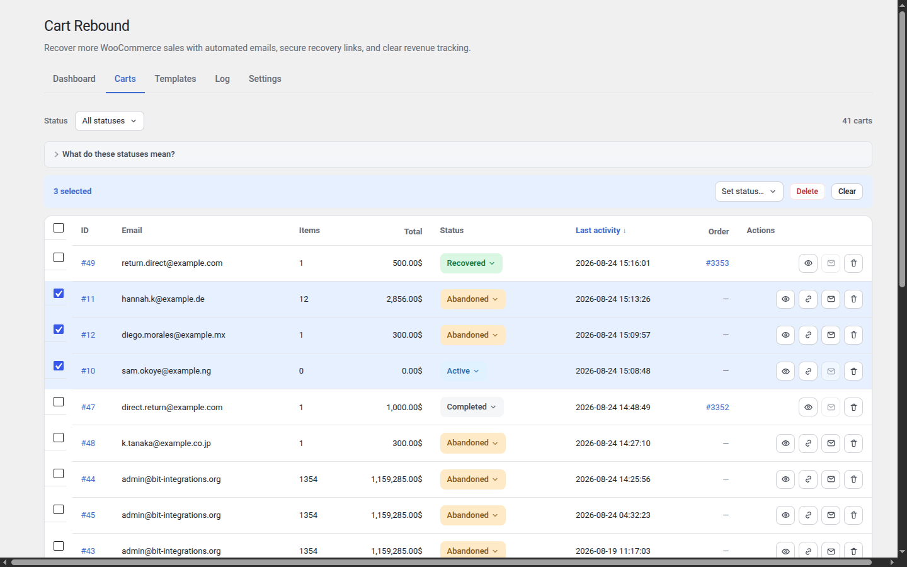

**Set status…** changes them all together, **Delete** removes them (it asks first), and **Clear** unticks everything.

---

## Templates — writing the email

**Cart Rebound → Templates** is where you write the reminder. You can keep several versions; the one marked **Default** is the one that goes out automatically.

### The message

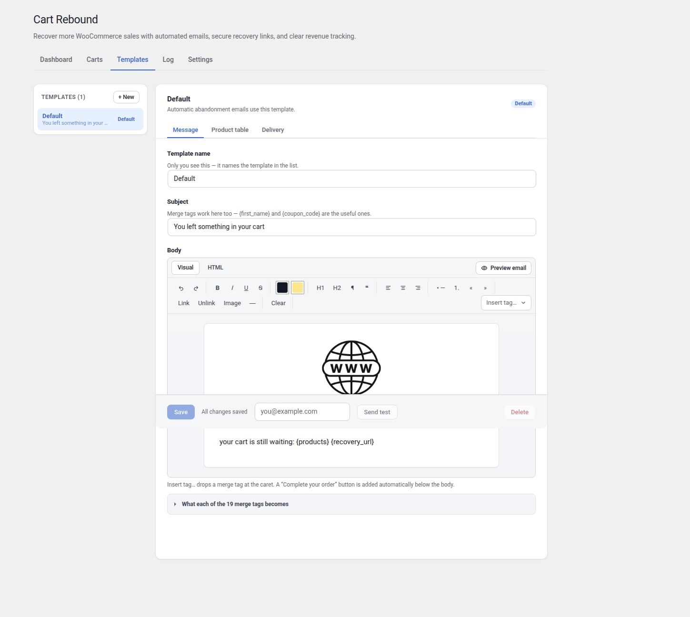

- **Template name** is just for you — customers never see it.
- **Subject** is the line they see in their inbox. Merge tags work here too: `Still thinking it over, {first_name}?`
- **Body** is a normal visual editor — bold, colours, headings, lists, links, images from your media library. There is an **HTML** tab if you prefer writing markup.
- **Insert tag…** drops a merge tag wherever your cursor is, so you do not have to remember the spelling.
- **You do not need to add a button.** A **Complete your order** button with the recovery link is added underneath your message automatically.

The save bar sits at the bottom of the screen and tells you whether you have unsaved changes. If you try to switch templates mid-edit, it warns you first.

### Merge tags

Open **What each of the 19 merge tags becomes** and the full list is right there in the editor.

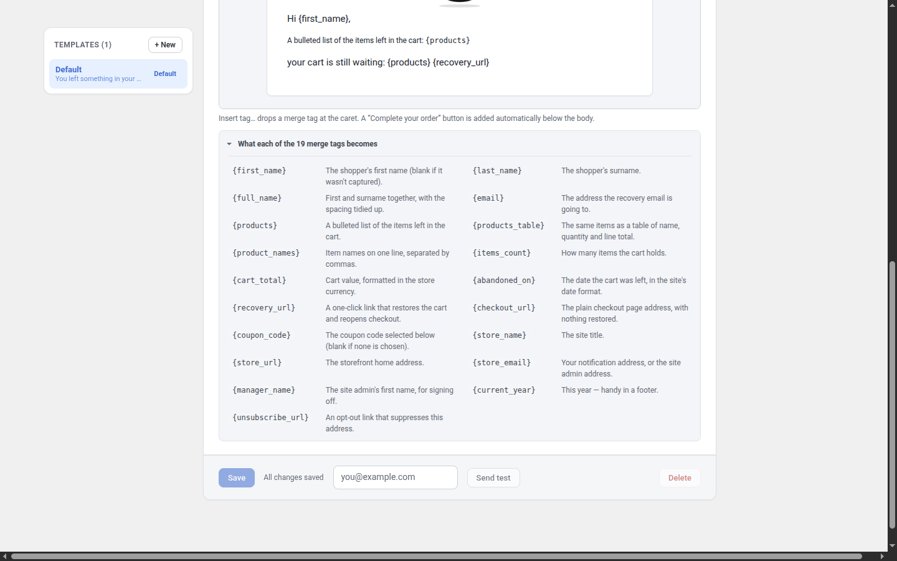

The handful you will actually use:

| Tag              | Becomes                                                 |
| ---------------- | ------------------------------------------------------- |
| `{first_name}`   | Their first name — the single best one to use.          |
| `{products}`     | A bulleted list of what they left behind.               |
| `{cart_total}`   | What the cart is worth, in your store's currency.       |
| `{coupon_code}`  | A discount code, if you choose one on the Delivery tab. |
| `{recovery_url}` | The one-click link back to their cart.                  |

There are 19 in total, covering their full name and email, the item count, the date they left, your store name and address, and more. The panel in the editor is the complete reference.

> **Do not worry about `{recovery_url}`** unless you want the raw link in your text. The **Complete your order** button already carries it.

### See it before you send it

**Preview email** shows the finished thing with sample data — a shopper called "Jordan" and two demo items — exactly as it will land.

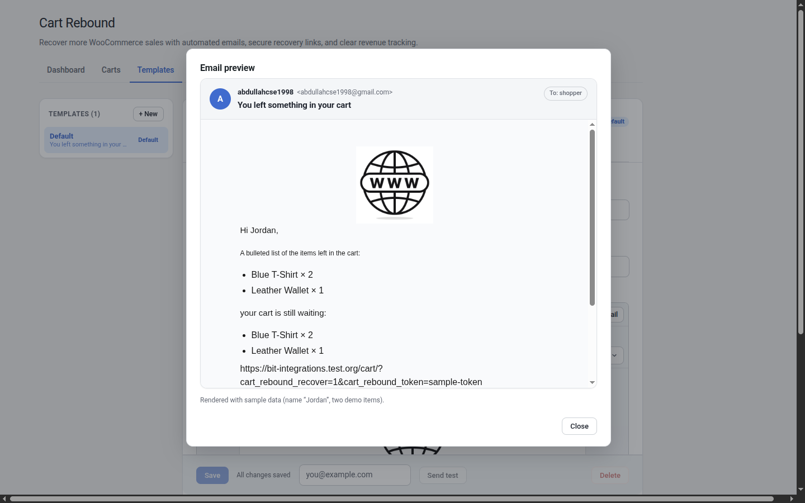

**Send test** mails that same preview to any address you type. Use a real inbox: previewing in the browser and checking it in Gmail are not the same test.

### The product table (optional)

Skip this section unless you want fine control over how the items are laid out. If `{products}` as a simple bulleted list is fine, you never need this tab.

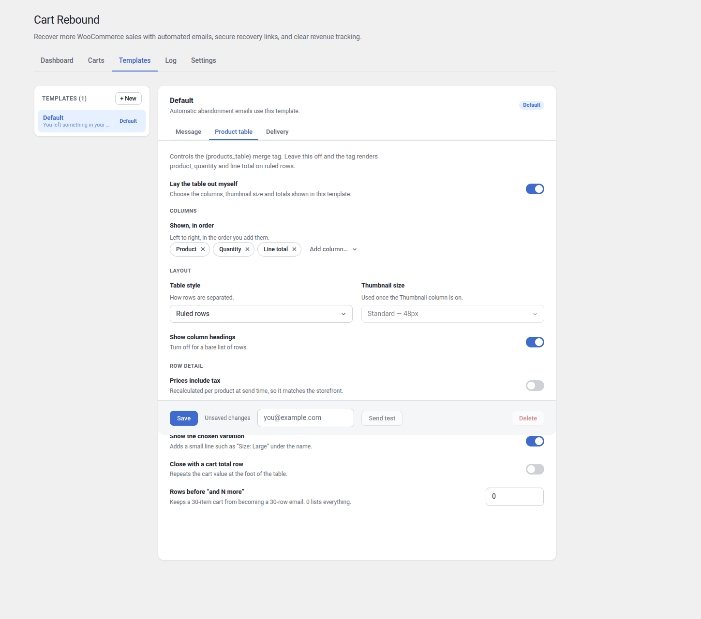

Turning on **Lay the table out myself** lets you choose columns and their order, ruled or boxed rows, thumbnail size, whether prices include tax, whether product names link, and how many rows to show before an "and N more items" line — worth setting if someone might abandon a thirty-item cart.

### Who it comes from

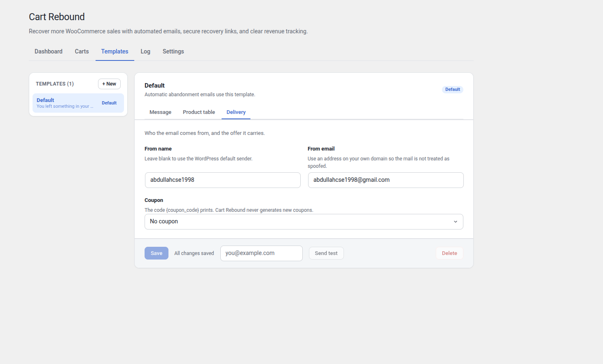

- **From name** and **From email** — leave blank to use your WordPress default. If you do set an address, **use one on your own domain**. A Gmail or Yahoo address here makes your email look forged and it will land in spam.
- **Coupon** — pick an existing WooCommerce coupon and `{coupon_code}` prints it. Cart Rebound never creates coupons; it only prints ones you already made.

---

## Log — what the plugin did and when

**Cart Rebound → Log** is the receipt for everything: every cart abandoned, every email sent, every recovery.

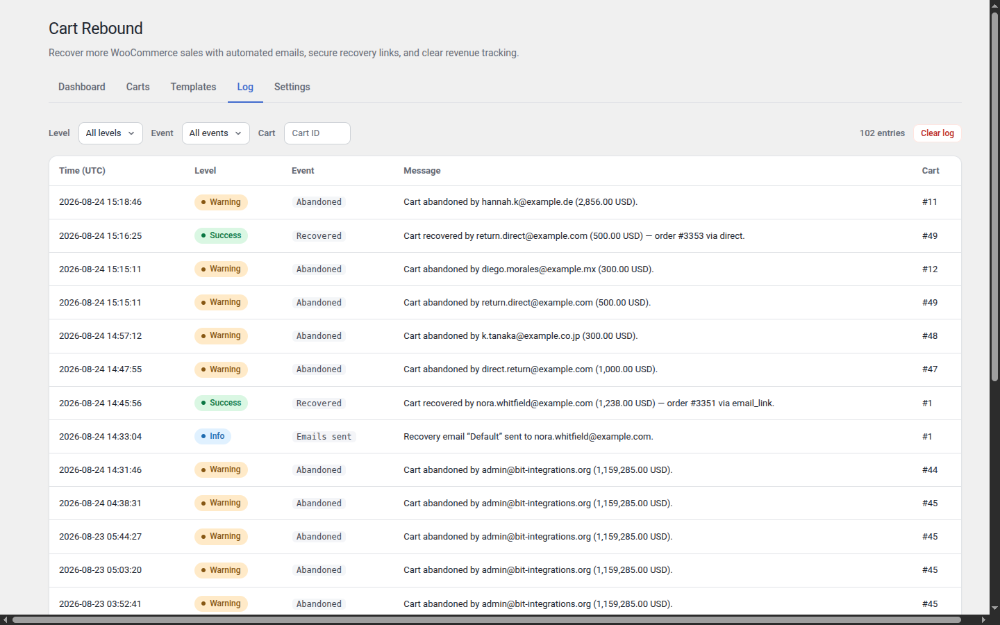

Filter by **Level**, by **Event** (Emails sent / Abandoned / Recovered), or by a specific **Cart ID**. The filters stack, and the count on the right always matches what you are looking at.

**This is the first place to look when something seems wrong.** If a cart has no _Abandoned_ entry, it was never eligible. If there is no _Emails sent_ entry, the email never left WordPress — so the problem is here, not with your mail provider.

**Clear log** empties it (it asks first). Clearing the log does not touch your carts or your reporting.

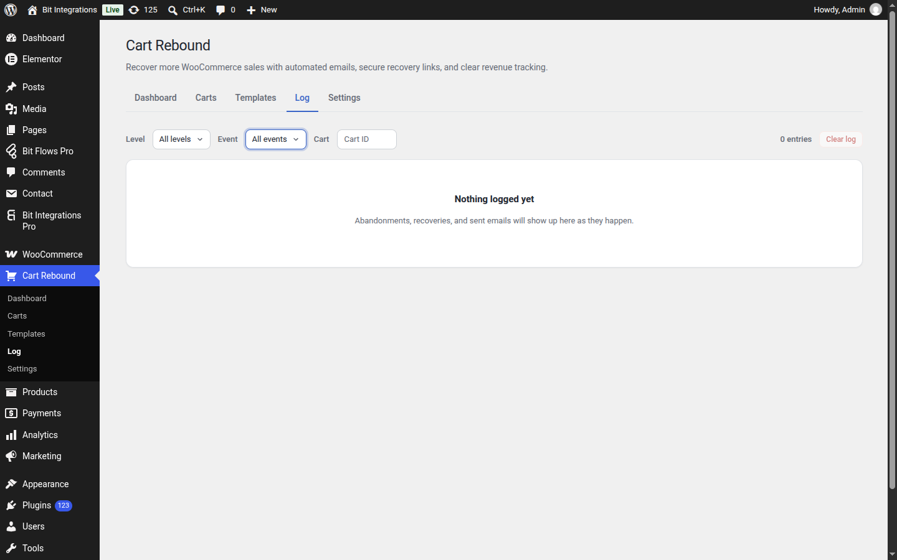

---

## Settings — the knobs

**Cart Rebound → Settings** holds everything the wizard asked, plus a few extras. You can safely leave all of this alone.

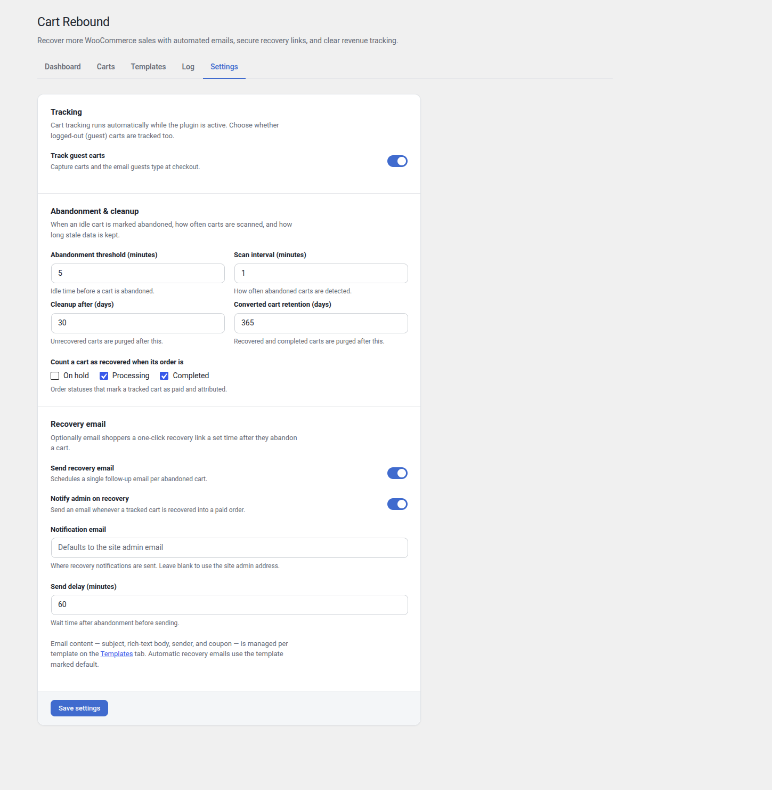

**Tracking**

- **Track guest carts** — capture carts and checkout emails from people who are not logged in. Leave this **on**.

**Abandonment & cleanup**

| Setting                                      | What it does                                            | Sensible value         |
| -------------------------------------------- | ------------------------------------------------------- | ---------------------- |
| Abandonment threshold                        | Idle time before a cart counts as abandoned.            | 30–60 minutes          |
| Scan interval                                | How often the plugin checks for newly idle carts.       | 5 minutes              |
| Cleanup after                                | When to delete carts that never converted.              | 30 days                |
| Converted cart retention                     | How long to keep the records of carts that did convert. | 365 days               |
| Count a cart as recovered when its order is… | Which order statuses count as "they actually paid".     | Processing + Completed |

Change the threshold and it takes effect on the very next check — there is nothing to restart.

**Recovery email**

| Setting                  | What it does                                                         |
| ------------------------ | -------------------------------------------------------------------- |
| Send recovery email      | The master switch for the automatic reminder.                        |
| Notify admin on recovery | Emails **you** whenever a cart is won back. Nice for the first week. |
| Notification email       | Where those go. Blank means your site admin address.                 |
| Send delay               | How long after abandonment the reminder goes out.                    |

The wording of the email is **not** here — subject, body, sender and coupon all live on the **Templates** tab.

---

## What your customer sees

### Clicking the link

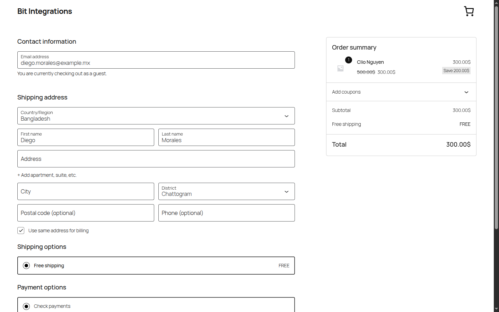

One tap and their cart is rebuilt exactly as they left it — right products, right quantities, right sizes and colours — with their email, name and phone already filled in. Nothing to re-add, nothing to retype.

A few careful details you get for free:

- If a coupon on their cart has since been deleted, it is quietly skipped rather than greeting them with a red error.
- Anything they have already filled in is left alone — a logged-in customer's saved address is never overwritten.
- The link carries a long random code, not their email or account details, and it stops working once the cart converts.

### Unsubscribing

Every reminder carries an unsubscribe link, as the law requires. It opens a confirmation page rather than acting on the click, so a spam scanner or a mis-tap cannot opt someone out by accident.

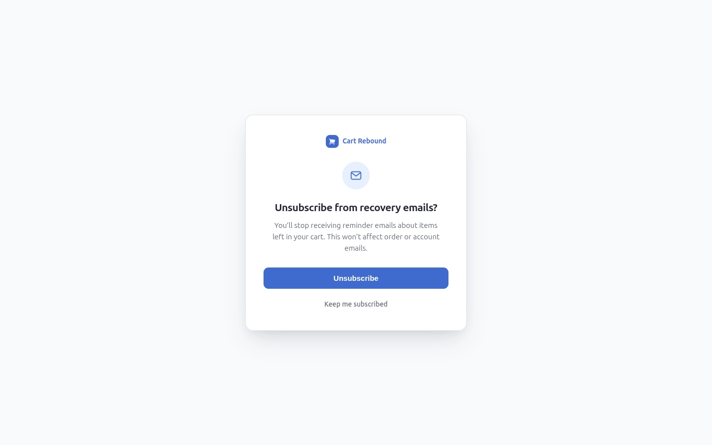

Confirming stops that address receiving recovery emails permanently — including ones you try to send by hand. It does not affect their order confirmations or account emails.

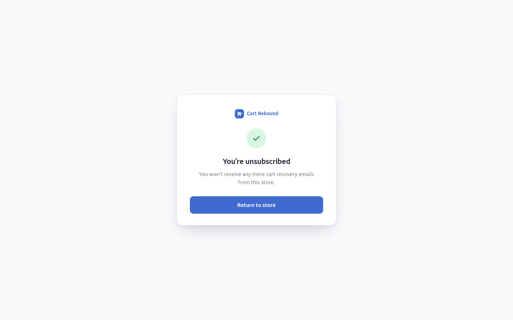

---

## The whole journey on one page

```
   customer adds items
           │
           ▼
      ┌─────────┐   nothing happens for a while    ┌───────────┐
      │ Active  │ ───────────────────────────────▶ │ Abandoned │
      └─────────┘   (and we have their email)      └───────────┘
           ▲                                              │
           │  they come back                              │  one reminder email
           └──────────────────────────────────────────────┤
                                                          │
                                                          ▼
                                                 ┌─────────────────┐
                        they place an order ───▶ │ Pending payment │
                                                 └─────────────────┘
                                                          │ the money arrives
                        ┌─────────────────────────────────┴─────────────┐
                        ▼                                               ▼
                  ┌───────────┐                                  ┌───────────┐
                  │ Recovered │  they had abandoned first        │ Completed │  they never abandoned
                  └───────────┘                                  └───────────┘
                        │                                               │
                        └──────── refunded or cancelled ──────▶ ┌───────┴──┐
                                                                │   Lost   │
                                                                └──────────┘
```

Two rules explain nearly everything you will see:

**Only real money counts.** An order sitting unpaid is **Pending payment**. It stops the reminder email — they have already ordered, telling them they forgot would be embarrassing — but it does not count as recovered revenue until the payment actually lands.

**Coming back counts however they come back.** If a cart was ever abandoned and later gets paid, that is **Recovered** — whether they clicked your email or just wandered back to the site themselves. Only a cart that was never abandoned at all counts as **Completed**. The WooCommerce order note records which route they took: _via email link_ or _via direct return_.

---

## Accessibility and other languages

The admin screens score **100 on Google's Lighthouse accessibility audit**. Every status label, link and button meets the WCAG AA contrast standard, every icon-only button carries a description for screen readers, and the loading animations stop for anyone whose system asks for reduced motion.

The plugin is fully translatable — 495 pieces of text, including everything inside the admin screens — and the layout mirrors correctly in right-to-left languages such as Arabic and Hebrew, with nothing extra to install.

---

## If something looks wrong

**No carts are showing up at all.**
Check WooCommerce is active. If the visitors are not logged in, check **Track guest carts** is switched on in Settings.

**Lots of Active carts, hardly any Abandoned ones.**
Normal. A cart only becomes abandoned once someone has given you an email address at checkout, and only after your threshold has passed. Everyone who left before the checkout form stays Active and gets cleaned up later.

**A particular cart never became abandoned.**
It needs three things: a captured email, at least one item, and enough idle time. Look it up by ID in the **Log** to see what the plugin thought.

**No email arrived.**
Check the **Log** for an _Emails sent_ entry for that cart.

- **The entry is there** → the email left WordPress, so the problem is delivery. Install an SMTP plugin and use **Send test** on the Templates tab until a test lands in a real inbox.
- **No entry** → the cart was not eligible when the time came: it had already converted, it had already been emailed once, or that address had unsubscribed.

**I pressed Send and nothing happened.**
Something did happen — look inside the dialog box. The reason is printed there in red. If it says WordPress could not send the email, that is your mail setup, not Cart Rebound.

**A cart that was definitely recovered says Completed.**
Open the WooCommerce order and read the order note. If it says _linked to tracked cart #N (completed)_, that cart genuinely never reached Abandoned — usually because your threshold is longer than the customer's pause. Shorten it.

**My revenue went down after a refund.**
That is intended. Refunding or cancelling an order moves the cart to **Lost** and removes the money from recovered revenue, so your reporting only ever shows sales you actually kept.

**The recovery rate does not match the boxes above it.**
It is not supposed to. The boxes are right now; the rate is your whole history, counted in a way that cleanup cannot inflate. See [Dashboard](#dashboard--how-am-i-doing).
